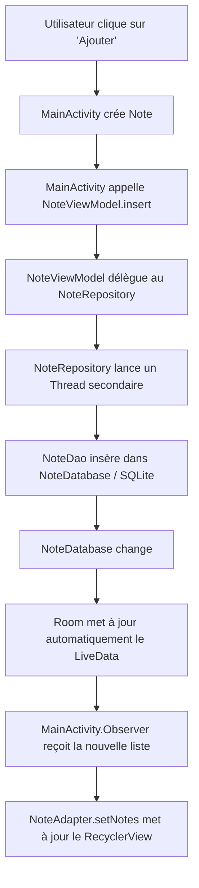

# LAB 19 — Architecture MVVM avec Room, Repository, LiveData et RecyclerView

Ce laboratoire met en pratique une architecture Android moderne et professionnelle recommandée par Google. L'application est un **Gestionnaire de Notes (Bloc-Notes)** complet permettant d'illustrer la persistance locale via Room Database et la gestion réactive de l'interface utilisateur.

---

## 🎯 Objectifs d'apprentissage

1. **Créer un modèle métier (Entity)** annoté avec Room.
2. **Définir un DAO (Data Access Object)** pour exposer des méthodes d'accès aux données avec support réactif (`LiveData`).
3. **Initialiser une base de données SQLite locale** thread-safe via RoomDatabase (Pattern Singleton).
4. **Implémenter le Repository Pattern** pour abstraire les sources de données et exécuter les opérations en arrière-plan (`ExecutorService`).
5. **Maîtriser le ViewModel et LiveData** pour garantir la survie des données lors des changements de configuration (rotation, thèmes).
6. **Mettre en œuvre un RecyclerView** performant avec liaison de données dynamique via un `Adapter`.

---

## 🏗️ Architecture du projet

Le projet est structuré de façon professionnelle pour assurer la séparation des responsabilités :

```
com.example.roommvvmdemo
│
├── data
│   ├── local
│   │   ├── Note.java          ← Entity (Table SQLite)
│   │   ├── NoteDao.java       ← Interface DAO (Requêtes SQL)
│   │   └── NoteDatabase.java  ← Singleton de la base de données Room
│   └── NoteRepository.java    ← Repository (Abstraction de la couche d'accès)
│
├── ui
│   ├── MainActivity.java      ← View (Interface utilisateur)
│   └── NoteAdapter.java       ← Adapter du RecyclerView (Liaison UI)
│
└── viewmodel
    └── NoteViewModel.java     ← ViewModel (Logique métier UI & cycle de vie)
```

---

## 📝 Description des composants

### 1. L'Entity : `Note.java`
Déclare la structure de la table SQLite `notes_table`.
- `@Entity` : Spécifie que cette classe correspond à une table de base de données.
- `@PrimaryKey(autoGenerate = true)` : Room génère l'identifiant auto-incrémenté.

### 2. Le DAO : `NoteDao.java`
Contient les signatures des méthodes de requêtes.
- `@Insert`, `@Delete` : Gérés automatiquement par Room.
- `@Query("...")` : Requêtes SQLite personnalisées.
- Retourner `LiveData<List<Note>>` permet d'observer en temps réel les changements de la base.

### 3. La Base Room : `NoteDatabase.java`
- Hérite de `RoomDatabase`.
- Contient une instance unique (Singleton) instanciée via `Room.databaseBuilder` avec la sécurité multi-thread (`volatile`, `synchronized`).
- `.fallbackToDestructiveMigration()` évite les plantages lors des changements de schémas en phase de développement.

### 4. Le Repository : `NoteRepository.java`
- Intermédiaire direct entre la base locale et le ViewModel.
- Gère le thread secondaire à l'aide d'un `ExecutorService` pour éviter de bloquer l'interface utilisateur lors des écritures (`insert`, `delete`, `deleteAllNotes`).

### 5. Le ViewModel : `NoteViewModel.java`
- Étend `AndroidViewModel` pour disposer du contexte de l'application de façon sécurisée.
- Permet à l'activité de s'abonner au `LiveData` sans se soucier du cycle de vie ou de la re-création de la base.

### 6. Le RecyclerView et Adapter : `NoteAdapter.java`
- Gère le recyclage des cellules de notes.
- Fournit une interface `OnItemLongClickListener` pour supprimer dynamiquement une note lors d'un appui long.

---

## 🔄 Flux complet de fonctionnement



---

## 🧪 Tests à réaliser

Pour valider le fonctionnement optimal de l'application, effectuez les scénarios de test suivants :

### Test 1 : Insertion simple
1. Saisissez un titre et une description.
2. Cliquez sur **AJOUTER LA NOTE**.
3. *Résultat attendu :* La note s'affiche instantanément au sommet du `RecyclerView` avec un design sous forme de carte.

### Test 2 : Suppression individuelle (Long Click)
1. Effectuez un appui long (long click) sur n'importe quelle note affichée dans la liste.
2. *Résultat attendu :* Un message Toast confirme la suppression et la note disparaît immédiatement avec une animation fluide.

### Test 3 : Persistance locale des données
1. Ajoutez plusieurs notes dans l'application.
2. Fermez complètement l'application (tuez le processus ou balayez-la depuis les applications récentes).
3. Relancez l'application.
4. *Résultat attendu :* Toutes vos notes précédentes sont toujours présentes et rechargées automatiquement depuis SQLite.

### Test 4 : Changement de configuration (Rotation d'écran)
1. Saisissez du texte ou visualisez votre liste existante.
2. Pivotez l'écran de l'émulateur (Ctrl + F11).
3. *Résultat attendu :* L'application se recharge parfaitement, aucun doublon n'est créé et la liste reste cohérente sans perte de données grâce au ViewModel.

### Test 5 : Suppression globale
1. Cliquez sur le bouton **SUPPRIMER TOUT**.
2. *Résultat attendu :* Toute la base de données Room est vidée instantanément et le RecyclerView affiche une interface vide de manière réactive.

---

## ⚙️ Configuration Gradle (Dépendances)

Les composants de base Room, Lifecycle et RecyclerView ont été intégrés à votre `build.gradle` :

```groovy
dependencies {
    // Lifecycle (ViewModel & LiveData)
    implementation 'androidx.lifecycle:lifecycle-viewmodel:2.7.0'
    implementation 'androidx.lifecycle:lifecycle-livedata:2.7.0'
    
    // Room components
    implementation 'androidx.room:room-runtime:2.6.1'
    annotationProcessor 'androidx.room:room-compiler:2.6.1'

    // UI & List Components
    implementation 'androidx.recyclerview:recyclerview:1.3.2'
    implementation 'com.google.android.material:material:1.11.0'
}
```

interface : 


